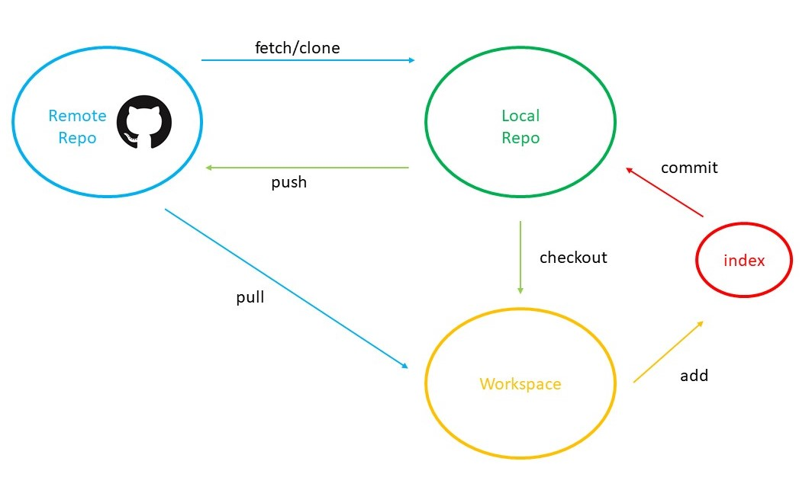

# Github tutorial on Github
As a green hand in github, I know how to use git to manage my code. However, I don't get how to use this in the real cases. So, I write the markdown file in the repository to record how I learn to use this fantastic tool.

## What's Github
At first, what would you prefer, "on", "in", or "at" github? The answer should be "on". Here is the [answer](https://ell.stackexchange.com/questions/89101/in-on-or-at-github).

Ok, let's go back to the topic. Here are some definitions of the items about github.

**Repository**: It is just like a project, you can save your codes about one project in the same repository.

**Star**: You star a project means you like the project and put into your "favorite" folder.

**Fork**: Copy the project to your own account. The edits on the forked repository will not be changed unless you send a request to the owner and the owner accepts.

**Pull request**: When you want to upload your code to the owner of the repository, you can pull request to the owner. When the request is accepted, the edits you make will be shown on the original repository.

**Watch**: Get notifications when the repository is updated.

**Issue**: When you find some bug, you can issue for the discussion.

## Create a repository
Github provides a easy operating interface for users. We are going to use **Git** or Pycharm to initiate a new repository.

## Git Workflow
If you want can change the target repository, your workflow will be like.

Here are some brief introductions:
1. **clone**: you can clone a remote repository to the local. It will be used for initiation.
2. **fetch**: get the new code to the local without merge. The edits will be shown in the code.
3. **checkout**: If you have a branch, you can switch branches by checkout.
4. **add**: put the code into the buffer zone before commit.
5. **commit**: submit to the local repo. History will be stored in the local.
6. **pull**: fetch and merge. the updated code will be in both local repo and workspace.
7. **push**: update the code to the remote repo.
