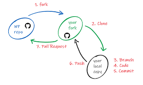
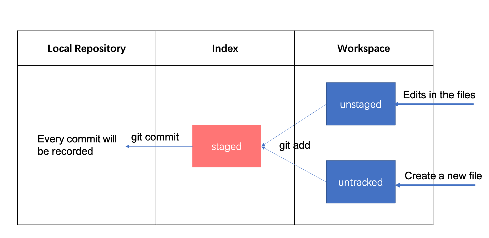

# Github tutorial on Github
As a green hand in github, I know how to use git to manage my code. However, I don't get how to use this in the real cases. So, I write the markdown file in the repository to record how I learn to use this fantastic tool.

## What's Github
At first, what would you prefer, "on", "in", or "at" github? The answer should be "on". Here is the [answer](https://ell.stackexchange.com/questions/89101/in-on-or-at-github).

Ok, let's go back to the topic. Here are some definitions of the items about github.

**Repository**: It is just like a project, you can save your codes about one project in the same repository.

**Star**: You star a project means you like the project and put into your "favorite" folder.

**Fork**: Copy the project to your own account. The edits on the forked repository will not be changed unless you send a request to the owner and the owner accepts.

**Pull request**: When you want to upload your code to the owner of the repository, you can pull request to the owner. When the request is accepted, the edits you make will be shown on the original repository.

**Watch**: Get notifications when the repository is updated.

**Issue**: When you find some bug, you can issue for the discussion.

## Create a repository
Github provides a easy operating interface for users. We are going to use **Git** or Pycharm to initiate a new repository.

## Git Workflow
If you have the privilege to change the target repository, your workflow will be like.


Here are some brief introductions:
1. **clone**: you can clone a remote repository to the local. It will be used for initiation.
2. **fetch**: get the new code to the local without merge. The edits will be shown in the code.
3. **checkout**: If you have a branch, you can switch branches by checkout.
4. **add**: put the code into the buffer zone before commit.
5. **commit**: submit to the local repo. History will be stored in the local.
6. **pull**: fetch and merge. the updated code will be in both local repo and workspace.
7. **push**: update the code to the remote repo.

When you want to get evolved in some repository of which you don't have the privilege, your workflow will be like.



The steps are similar to the previous one. However, you need to first fork the repository to your own account. After you finished changing, you need to pull request to make your code updated to the original one.

## Download Git
Before we start using Git, we need to download it in your computer. Also, you can download Git from your IDE. However, it would be great if you can download on your computer directly. The IDE can automatically track your Git and use it.

You can download Git from the [link](https://git-scm.com/downloads). When you right click and find Git GUI and Git Bash, it indicates you install successfully.

## Configure Git
There are some methods to log in your account.
1. Use IDE. When you first use Git in Pycharm, there will be a window to log-in. The software will remember your account and password.
2. Use command lines. You can do this in Git Bash and any terminal.
```angular2html
git config --global user.name "your name"
git config --global user.email "your email"
## check your information
git config --global user.name
git config --global user.email
```

## Get local repository by command line
1. Create an empty folder;
2. Open Git Bash
3. run "git init"

## Branch
1. create a branch
```angular2html
git branch new-branch-name
```
2. change to the branch
```angular2html
git checkout branch-name
```
3. create and go to the new branch
```angular2html
git checkout -b new-branch
```
4. delete the branch
```angular2html
git branch -d new-branch
```
5. merge the branch: Both branches will point at the same commit.
```angular2html
## commit all changes in your updated branch, then back to the main branch
git checkout main
## merge the branch
git merge new-branch
```
6. merge conflicts: when you merge the new branch back to the main branch, you may encounter merge conflicts. You will get like below:
```angular2html
<<<<<<< HEAD
print("hello world?")
=======
str_1 = "hello world"
print(str_1)
>>>>>>> new-branch
```
You need to clean the codes you don't need and get like below:
```angular2html
print("hello world?")
```
Then add and commit the new changes to the Git:
```angular2html
git commit -a
```
7. abort the merge. after you try the merge and you find that's what you expect , you can use the command to abort the merge.
```angular2html
git merge --abort
```

## Fast-forward and three-way merge
The main difference between two merge types is that fast-forward merge diverge but three-way merge doesn't.

A fast-forward merge can occur when there is a linear path from the current branch tip to the target branch.

<p align="center">Credit <a href="https://www.atlassian.com/git/tutorials/using-branches/git-merge">Bitbucket</a></p>

Three-way merges use a dedicated commit totie together the two histories. 
A fast-forward merge can occur when there is a linear path from the current branch tip to the target branch.

<p align="center">Credit <a href="https://www.atlassian.com/git/tutorials/using-branches/git-merge">Bitbucket</a></p>

## What is Git Head
The term HEAD refers to **the current commit you are viewing**.

By default, you’ll view the tip of the master branch on a repository, unless the main branch of your repository has a different name. The tip of the master branch is the most recent commit on the main branch of your codebase.

## Remote basics
Remote branches are references (pointers) to the state of branches in your remote repositories. They’re local branches that you can’t move; they’re moved automatically for you whenever you do any network communication. Remote branches act as bookmarks to remind you where the branches on your remote repositories were the last time you connected to them.


Git’s clone command automatically names it origin for you, pulls down all its data, creates a pointer to where its master branch is, and names it origin/master locally.
Check with remote.Git also gives you your own local master branch starting at the same place as origin’s master branch, so you have something to work from.
```angular2html
git remote -v
```

You will get two links:
```angular2html
origin  https://github.com/user/repo.git (fetch)
origin  https://github.com/user/repo.git (push)
```
But in some cases, you can have the fetch URL use HTTP for read only access, and the push URL use HTTPS or SSH for access control.

To get more information about the remote repo:
```angular2html
git remote show origin
```
It will show the Fetch and Push URL, HEAD branch, remote branch, local branch configured for "git pull" and "git push"

## The workflow of forking and pulling request

## Local common commands
At first, we need to know how to work with github locally. Every time we made edits in the working folder, we need to use "git add ." to add all files to the index. The dot '.' indicates all files in the working folder. Then, use git commit -m _'comment for the commit'_ to update the new edits to the repository.


There are some additional command that are useful in daily usage.
1. git status. It will show "changes to be commited" when you add the changes to the index. It will show "nothing to commit" if you commit all changes.
2. git log. show the log of the local repository.
- --all: show all branches
- --pretty=oneline: show all information in one line
- --abbrev-commit: use the abbreviations when showing the message
- --graph: show the information by a graph.
- -p: produce the patch text.
3. git reset --hard commitID: back to previous version. commitID can be checked by log.
4. git reflog: find the log even though you cleared.

.gitignore save the filename you don't want to add to the index or commit to the local repository.

## Regrets in different status
### Modified
1. Don't want to stage the file.
```angular2html
git checkout filename
```
### Staged
1. want to unstage the file you don't want to add
```angular2html
git reset HEAD filename
```
### Merged
1. want to abort the merge from other branches
```angular2html
git merge --abort
```
### Commited
1. want to make subtle changes to the previous commit (before pusing to the remote)
```angular2html
git commit --amend
```
2. want to revert the commit (Given one or more existing commits, revert the changes that the related patches introduce, and record some new commits that record them. This requires your working tree to be clean (no modifications from the HEAD commit).)
```angular2html
## after that please add description of why you revert the commit
git revert commit-ID
# or go back to the last commit
git revert HEAD^
```
### Pushed
## Resetting vs. reverting
It's important to understand that git revert undoes a single commit—it does not "revert" back to the previous state of a project by removing all subsequent commits. In Git, this is actually called a reset, not a revert.

Reverting has two important advantages over resetting. First, **it doesn’t change the project history**, which makes it a “safe” operation for commits that have already been published to a shared repository.

Second, **git revert is able to target an individual commit at an arbitrary point in the history**, whereas git reset can only work backward from the current commit.
## Tips
1. When you commit something to your local repo and you want to undo, you should use
```angular2html
## --soft: undo your commit
git reset --soft HEAD^
## --hard: undo your commit and add
git reset --hard HEAD^
## HEAD^ means HEAD~1, HEAD~i means back to i commits before 
```
2. update the forked repo
```angular2html
# Add the remote, call it "upstream":

git remote add upstream https://github.com/whoever/whatever.git

# Fetch all the branches of that remote into remote-tracking branches

git fetch upstream

# Make sure that you're on your master branch:

git checkout master

# Rewrite your master branch so that any commits of yours that
# aren't already in upstream/master are replayed on top of that
# other branch:

git rebase upstream/master
```
3. update the data to a new-created repo
```angular2html
### init git
git init -b main

### add all to the local 
git add . && git commit -m "initial commit"

### push the repo and set upstream
git push --set-upstream origin main
```